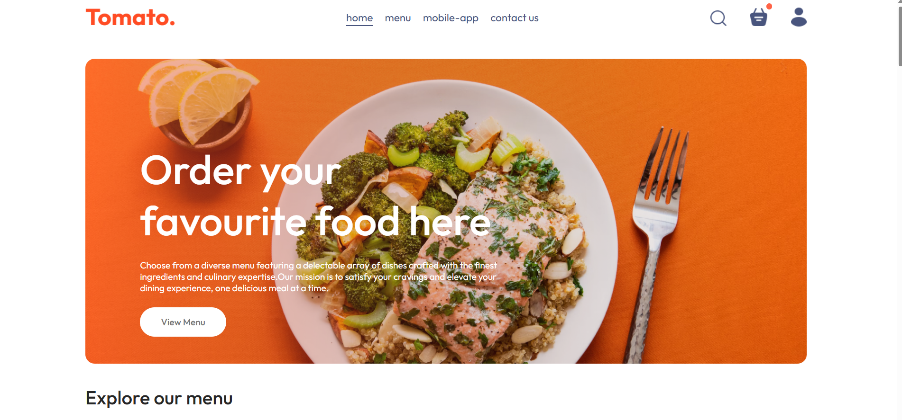
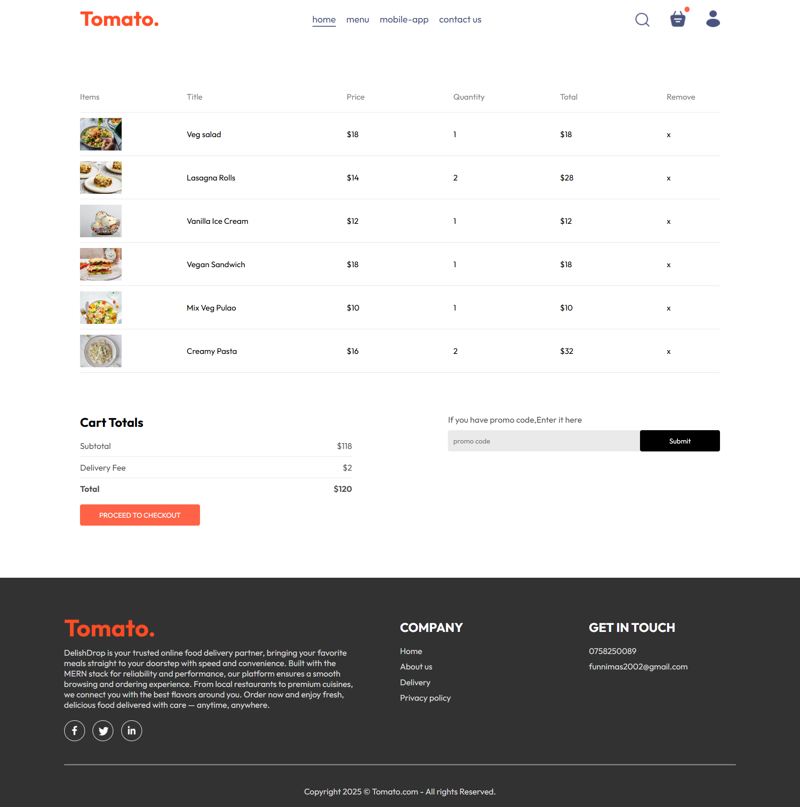
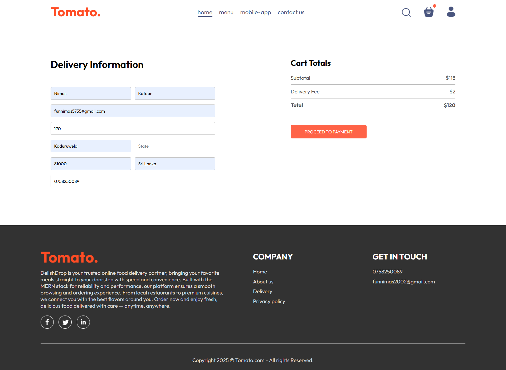

# 🍕 Tomato - MERN Food Delivery App

A full-stack food delivery platform built with MongoDB, Express.js, React, and Node.js.



## ✨ Features

- 🔐 User authentication (JWT)
- 🛒 Shopping cart functionality
- 💳 Secure payment integration
- 📱 Responsive design
- 👨‍💼 Admin dashboard
- 📦 Order tracking

## 🛠️ Tech Stack

**Frontend:**

- React.js (Vite)
- React Router
- Context API / Redux
- Axios

**Backend:**

- Node.js
- Express.js
- MongoDB
- Mongoose
- JWT Authentication
- Bcrypt

**Payment:**

- Stripe

## 🔄 Project Status

- ✅ Frontend: Fully developed & deployed
- ✅ Backend: Fully developed & tested locally
- ⏳ Backend Deployment: Pending (working on hosting solution)
- ⏳ Full-stack Integration: Ready once backend is deployed

## 💻 Run Locally (Full Stack)

To run the complete application with backend:

## 📦 Installation

### Prerequisites

- Node.js (v14+)
- MongoDB
- npm

  **Live Demo**: [https://food-delivery-mern-1rg4.vercel.app/?]

### Clone the repository

```bash
git clone https://github.com/Kafoor-Nimas/Food-Delivery-MERN.git
cd Food-del
```

### Backend Setup

```bash
cd backend
npm install
cp .env.example .env
# Add your environment variables
npm run server
```

### Frontend Setup

```bash
cd front-end
npm install
npm run dev
```

## 🔐 Environment Variables

Create `.env` file in backend directory:

```env
JWT_SECRET=your_jwt_secret
STRIPE_SECRET_KEY=your_stripe_key
```

📸 Screenshots

Home Page


Cart Page



Checkout & Place-order Page



Admin-panel Page


## 🚀 Deployment

- Frontend: Vercel
- Backend: Render
- Database: MongoDB Atlas

💡 **For Recruiters:** Full backend code is available in the repository. Happy to demonstrate the complete application running locally or discuss deployment solutions.

## 👨‍💻 Author

**Kafoor Nimas**

- GitHub: [@Nimas](https://github.com/Kafoor-Nimas)
- LinkedIn: [Nimas](https://linkedin.com/in/nimas-kafoor)
- Email: nimaskafoor@gmail.com

## 📝 License

This project is licensed under the MIT License.

## 🙏 Acknowledgments

- Design inspiration from popular food delivery apps
- Built with Vite for fast development experience
